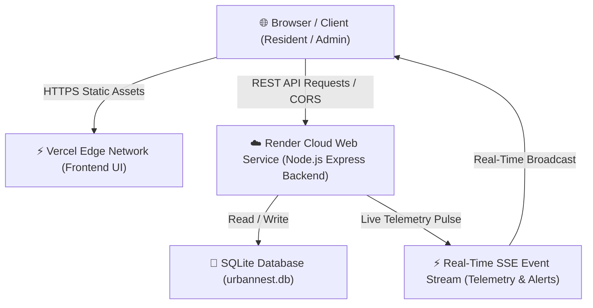

# 🚀 Urban Nest Deployment Guide (Render + Vercel)

This comprehensive guide will walk you through deploying **Urban Nest** with:
- **Backend**: Hosted on [Render](https://render.com) (Node.js Express + SQLite + Server-Sent Events SSE Stream).
- **Frontend**: Hosted on [Vercel](https://vercel.com) (High-speed Global Edge Static Dashboard).

---

## 🏗️ Architecture Overview



---

## 📋 Pre-Deployment Checklist

Before deploying, make sure you push all recent fixes to your GitHub repository:
- ✅ Removed tracked Windows `node_modules` from Git (fixes the `invalid ELF header` error).
- ✅ Added `.gitignore` to prevent committing binary modules.
- ✅ Added `render.yaml` Blueprint specification.
- ✅ Added `apiConfigModal.js` and dynamic URL resolution for instant backend connection switching.

### 1. Commit and Push Fixes to GitHub

Open terminal in `Urban_Nest` and run:

```bash
git add .
git commit -m "fix: prepare backend for Render deployment and frontend for Vercel"
git push origin main
```

---

## 🛠️ Step 1: Deploy Backend to Render

Render is ideal for the Node.js backend because it supports long-lived Server-Sent Events (SSE) connections and continuous background services.

### Option A: 1-Click Blueprint (Recommended)
1. Go to [dashboard.render.com](https://dashboard.render.com).
2. Click **New +** ➔ **Blueprint**.
3. Connect your GitHub repository (`Urban_nest`).
4. Render will detect `render.yaml` automatically.
5. Click **Apply**. Render will automatically provision:
   - **Service Name**: `urban-nest-backend`
   - **Environment**: `Node`
   - **Build Command**: `npm install`
   - **Start Command**: `npm start`
   - **Health Check**: `/health`

### Option B: Manual Web Service Setup
If you prefer setting up manually on Render:
1. In Render Dashboard, click **New +** ➔ **Web Service**.
2. Select **Build and deploy from a Git repository** and pick your repo.
3. Fill in the service configuration:
   - **Name**: `urban-nest-backend`
   - **Region**: Oregon (US West) or Frankfurt (EU)
   - **Branch**: `main`
   - **Root Directory**: *(Leave blank)*
   - **Runtime**: `Node`
   - **Build Command**: `npm install`
   - **Start Command**: `npm start`
   - **Instance Type**: `Free`
4. Expand **Advanced** and set Environment Variables:
   - `NODE_ENV` = `production`
   - `JWT_SECRET` = *(Click "Generate" or enter a secure random secret)*
5. Click **Create Web Service**.

> [!TIP]
> Once deployed, Render will provide your unique backend URL, for example:  
> `https://urban-nest-backend.onrender.com`  
> Copy this URL! You will use it for your Vercel frontend.

---

## ⚡ Step 2: Deploy Frontend to Vercel

Vercel provides lightning-fast global CDN edge hosting for the vanilla HTML/CSS/JS frontend.

1. Go to [vercel.com](https://vercel.com) and log in.
2. Click **Add New...** ➔ **Project**.
3. Import your GitHub repository (`Urban_nest`).
4. Configure Project Settings:
   - **Project Name**: `urban-nest`
   - **Framework Preset**: `Other`
   - **Root Directory**: `./` (or select `frontend` if deploying frontend alone)
   - **Build & Development Settings**: Keep defaults (No build command needed).
5. Click **Deploy**.

Within 10–20 seconds, Vercel will output your live URL:  
`https://urban-nest.vercel.app` (or similar).

---

## 🔗 Step 3: Connect Frontend to Render Backend

You have two convenient ways to connect your Vercel frontend to your Render backend:

### Method A: In-App Connection Switcher (Zero-redeploy, Immediate)
1. Open your live Vercel app in your browser (e.g. `https://urban-nest.vercel.app`).
2. In the top navigation bar, click the **<i class="fa-solid fa-cloud"></i> API** button (next to *Register*).
3. Paste your Render backend API URL:
   ```
   https://urban-nest-backend.onrender.com/api/v1
   ```
4. Click **Test Ping Endpoint** (it will test `/health` and display latency).
5. Click **Save & Connect**.
6. The app will immediately save this URL to `localStorage`, connect to the live telemetry SSE stream, and load your properties and demo users!

### Method B: Set Default in Code
If you want all visitors to automatically connect to your Render backend by default:
1. Open [frontend/js/config.js](file:///c:/Urban_Nest/frontend/js/config.js).
2. Change the default production fallback from `'/api/v1'` to your Render URL:
   ```javascript
   // frontend/js/config.js line 22:
   return 'https://urban-nest-backend.onrender.com/api/v1';
   ```
3. Commit and push to GitHub (`git commit -am "chore: set default Render backend URL" && git push`). Vercel will automatically re-deploy in seconds!

---

## 🧪 Step 4: Verification & Testing

Once connected, verify that all systems are operational:

1. **Health Check**:
   Visit `https://your-render-app.onrender.com/health` in your browser. You should see:
   ```json
   {
     "status": "healthy",
     "timestamp": "2026-09-22T...",
     "uptime": 45.2,
     "platform": "Urban Nest Backend",
     "version": "1.0.0"
   }
   ```

2. **Live Telemetry Stream (SSE)**:
   In the frontend top bar, check the **LIVE TELEMETRY** status pill. It should glow green with a pulsing dot.

3. **Persona Quick Switcher**:
   Click on **Super Admin**, **Property Admin**, **Security Guard**, or **Resident** at the top bar to verify role switching and instant database queries.

4. **Add New Venture / Visitor**:
   - Click **+ Add Venture** to create a new property venture.
   - Go to **Visitors & Gatekeeper** to pre-approve a guest or simulate a gate check-in.

---

## 🔍 Troubleshooting & FAQ

### Q1: Why did Render fail earlier with `invalid ELF header`?
**Explanation**: `sqlite3` is a native C++ Node addon. When `backend/node_modules` was committed into Git from a Windows machine, the compiled Windows `.node` binary was pushed. When Render's Linux server attempted to load the Windows binary, it threw `invalid ELF header`.  
**Resolution**: We untracked `node_modules` from Git and created `.gitignore`. On Render, `npm install` now cleanly installs and compiles the proper Linux native binaries.

### Q2: Render Free Tier "Cold Starts"
On Render's Free Plan, web services spin down after 15 minutes of inactivity. The first request after idle may take 30–50 seconds to wake up.
- **Tip**: You can use free monitoring tools like [UptimeRobot](https://uptimerobot.com) or [Cron-Job.org](https://cron-job.org) to ping `https://your-render-app.onrender.com/health` every 10 minutes to keep it warm 24/7!

### Q3: How is data stored?
Urban Nest uses SQLite (`urbannest.db`). On first boot, it automatically seeds all initial demo ventures, blocks, floors, flats, smart meters, and demo personas.

---

**🎉 Congratulations! Your Urban Nest Multi-Venture PropTech Platform is now live across Render & Vercel!**
