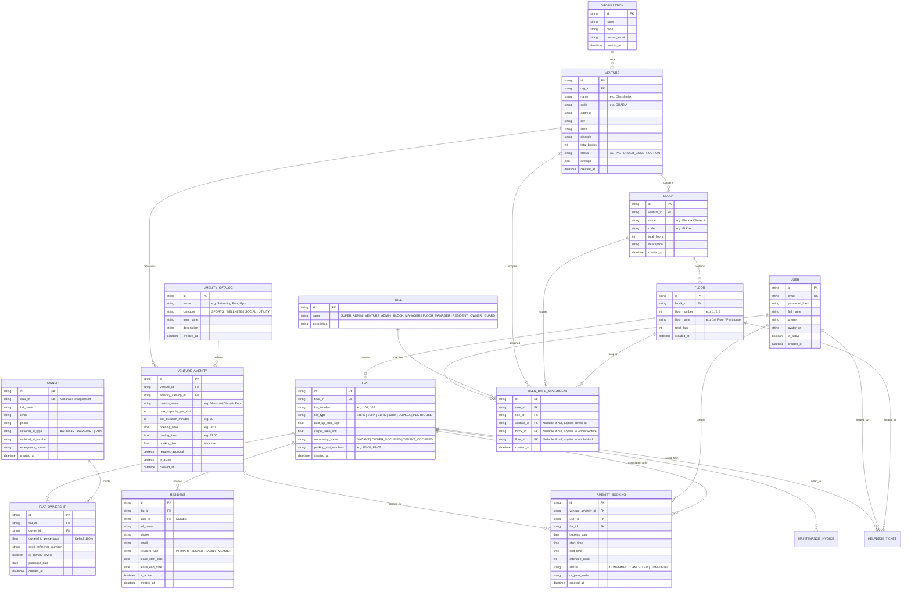

# Urban Nest: Database Schema & Relational Design

## 1. Entity-Relationship Diagram (ERD)



---

## 2. Relational Schema in Prisma Format (`schema.prisma`)

```prisma
// datasource and client
datasource db {
  provider = "sqlite" // Can switch seamlessly to "postgresql"
  url      = env("DATABASE_URL")
}

generator client {
  provider = "prisma-client-js"
}

// --------------------------------------------------------------------------
// 1. Core Users & Hierarchical RBAC
// --------------------------------------------------------------------------

model User {
  id              String                @id @default(uuid())
  email           String                @unique
  passwordHash    String
  fullName        String
  phone           String?
  avatarUrl       String?
  isActive        Boolean               @default(true)
  createdAt       DateTime              @default(now())
  updatedAt       DateTime              @updatedAt

  roleAssignments UserRoleAssignment[]
  bookings        AmenityBooking[]
  raisedTickets   HelpdeskTicket[]
  ownerProfile    Owner?
  residentProfile Resident?

  @@map("users")
}

model Role {
  id          String                @id @default(uuid())
  name        String                @unique // SUPER_ADMIN, VENTURE_ADMIN, BLOCK_MANAGER, FLOOR_MANAGER, OWNER, RESIDENT, GUARD
  description String?
  assignments UserRoleAssignment[]

  @@map("roles")
}

model UserRoleAssignment {
  id          String    @id @default(uuid())
  userId      String
  roleId      String
  ventureId   String?   // Scoped to specific venture (null for Super Admin)
  blockId     String?   // Scoped to specific block (for Block Manager)
  floorId     String?   // Scoped to specific floor (for Floor Manager)
  createdAt   DateTime  @default(now())

  user        User      @relation(fields: [userId], references: [id], onDelete: Cascade)
  role        Role      @relation(fields: [roleId], references: [id], onDelete: Cascade)
  venture     Venture?  @relation(fields: [ventureId], references: [id], onDelete: Cascade)
  block       Block?    @relation(fields: [blockId], references: [id], onDelete: Cascade)
  floor       Floor?    @relation(fields: [floorId], references: [id], onDelete: Cascade)

  @@index([userId])
  @@index([ventureId, blockId, floorId])
  @@map("user_role_assignments")
}

// --------------------------------------------------------------------------
// 2. Organization & Venture Multi-Tenancy Hierarchy
// --------------------------------------------------------------------------

model Organization {
  id            String    @id @default(uuid())
  name          String
  code          String    @unique
  contactEmail  String?
  createdAt     DateTime  @default(now())
  updatedAt     DateTime  @updatedAt

  ventures      Venture[]

  @@map("organizations")
}

model Venture {
  id              String               @id @default(uuid())
  organizationId  String
  name            String               // e.g. "Dharshini A - Luxury Enclave"
  code            String               @unique // e.g. "DHAR-A"
  address         String
  city            String
  state           String
  pincode         String
  status          String               @default("ACTIVE") // ACTIVE, UNDER_CONSTRUCTION
  settings        String?              // JSON metadata (rules, maintenance rate per sqft, etc.)
  createdAt       DateTime             @default(now())
  updatedAt       DateTime             @updatedAt

  organization    Organization         @relation(fields: [organizationId], references: [id], onDelete: Cascade)
  blocks          Block[]
  amenities       VentureAmenity[]
  roleAssignments UserRoleAssignment[]
  maintenanceRate Float                @default(3.50) // Default monthly rate per sqft

  @@index([organizationId])
  @@map("ventures")
}

model Block {
  id              String               @id @default(uuid())
  ventureId       String
  name            String               // e.g. "Block A", "Tower 1"
  code            String               // e.g. "BLK-A"
  totalFloors     Int                  @default(1)
  description     String?
  createdAt       DateTime             @default(now())
  updatedAt       DateTime             @updatedAt

  venture         Venture              @relation(fields: [ventureId], references: [id], onDelete: Cascade)
  floors          Floor[]
  roleAssignments UserRoleAssignment[]

  @@unique([ventureId, code])
  @@index([ventureId])
  @@map("blocks")
}

model Floor {
  id              String               @id @default(uuid())
  blockId         String
  floorNumber     Int                  // e.g. 1, 2, 3, 4
  floorName       String               // e.g. "1st Floor", "Penthouse Level"
  totalFlats      Int                  @default(4)
  createdAt       DateTime             @default(now())
  updatedAt       DateTime             @updatedAt

  block           Block                @relation(fields: [blockId], references: [id], onDelete: Cascade)
  flats           Flat[]
  tickets         HelpdeskTicket[]
  roleAssignments UserRoleAssignment[]

  @@unique([blockId, floorNumber])
  @@index([blockId])
  @@map("floors")
}

model Flat {
  id                  String               @id @default(uuid())
  floorId             String
  flatNumber          String               // e.g. "101", "204"
  flatType            String               @default("2BHK") // 1BHK, 2BHK, 3BHK, 4BHK, DUPLEX, PENTHOUSE
  builtUpAreaSqft     Float
  carpetAreaSqft      Float
  occupancyStatus     String               @default("VACANT") // VACANT, OWNER_OCCUPIED, TENANT_OCCUPIED
  parkingSlotNumbers  String?              // e.g. "P1-04, P1-05"
  createdAt           DateTime             @default(now())
  updatedAt           DateTime             @updatedAt

  floor               Floor                @relation(fields: [floorId], references: [id], onDelete: Cascade)
  ownerships          FlatOwnership[]
  residents           Resident[]
  maintenanceInvoices MaintenanceInvoice[]
  bookings            AmenityBooking[]
  tickets             HelpdeskTicket[]

  @@unique([floorId, flatNumber])
  @@index([floorId])
  @@map("flats")
}

// --------------------------------------------------------------------------
// 3. Owners & Residents Segregation
// --------------------------------------------------------------------------

model Owner {
  id                  String          @id @default(uuid())
  userId              String?         @unique // Optional link to User login
  fullName            String
  email               String          @unique
  phone               String
  nationalIdType      String?         // AADHAAR, PASSPORT, PAN
  nationalIdNumber    String?
  emergencyContact    String?
  createdAt           DateTime        @default(now())
  updatedAt           DateTime        @updatedAt

  user                User?           @relation(fields: [userId], references: [id], onDelete: SetNull)
  flatOwnerships      FlatOwnership[]

  @@map("owners")
}

model FlatOwnership {
  id                  String          @id @default(uuid())
  flatId              String
  ownerId             String
  ownershipPercentage Float           @default(100.0)
  deedReferenceNumber String?
  isPrimaryOwner      Boolean         @default(true)
  purchaseDate        DateTime?
  createdAt           DateTime        @default(now())

  flat                Flat            @relation(fields: [flatId], references: [id], onDelete: Cascade)
  owner               Owner           @relation(fields: [ownerId], references: [id], onDelete: Cascade)

  @@unique([flatId, ownerId])
  @@index([flatId])
  @@index([ownerId])
  @@map("flat_ownerships")
}

model Resident {
  id              String          @id @default(uuid())
  flatId          String
  userId          String?         @unique
  fullName        String
  phone           String
  email           String?
  residentType    String          @default("PRIMARY_TENANT") // PRIMARY_TENANT, FAMILY_MEMBER
  leaseStartDate  DateTime?
  leaseEndDate    DateTime?
  isActive        Boolean         @default(true)
  createdAt       DateTime        @default(now())
  updatedAt       DateTime        @updatedAt

  flat            Flat            @relation(fields: [flatId], references: [id], onDelete: Cascade)
  user            User?           @relation(fields: [userId], references: [id], onDelete: SetNull)

  @@index([flatId])
  @@map("residents")
}

// --------------------------------------------------------------------------
// 4. Dynamic Amenities & Booking Engine
// --------------------------------------------------------------------------

model AmenityCatalog {
  id              String           @id @default(uuid())
  name            String           @unique // Swimming Pool, Gymnasium, Badminton Court, Banquet Hall, EV Charging, Tennis Court, Rooftop Lounge, Steam & Sauna
  category        String           // SPORTS, WELLNESS, SOCIAL, UTILITY
  iconName        String           // Lucide icon key: "waves", "dumbbell", "activity", etc.
  description     String?
  createdAt       DateTime         @default(now())

  ventureAmenities VentureAmenity[]

  @@map("amenity_catalog")
}

model VentureAmenity {
  id                  String          @id @default(uuid())
  ventureId           String
  amenityCatalogId    String
  customName          String?         // e.g. "Dharshini A Olympic Pool"
  maxCapacityPerSlot  Int             @default(20)
  slotDurationMinutes Int             @default(60)
  openingTime         String          @default("06:00") // HH:mm
  closingTime         String          @default("22:00") // HH:mm
  bookingFee          Float           @default(0.0) // 0 for free resident access
  requiresApproval    Boolean         @default(false)
  isActive            Boolean         @default(true)
  createdAt           DateTime        @default(now())
  updatedAt           DateTime        @updatedAt

  venture             Venture         @relation(fields: [ventureId], references: [id], onDelete: Cascade)
  catalogItem         AmenityCatalog  @relation(fields: [amenityCatalogId], references: [id], onDelete: Cascade)
  bookings            AmenityBooking[]

  @@unique([ventureId, amenityCatalogId])
  @@index([ventureId])
  @@map("venture_amenities")
}

model AmenityBooking {
  id                String          @id @default(uuid())
  ventureAmenityId  String
  userId            String
  flatId            String
  bookingDate       DateTime        // Date of booking
  startTime         String          // "07:00"
  endTime           String          // "08:00"
  attendeeCount     Int             @default(1)
  status            String          @default("CONFIRMED") // CONFIRMED, CANCELLED, COMPLETED
  qrPassCode        String          @unique @default(uuid())
  amountPaid        Float           @default(0.0)
  notes             String?
  createdAt         DateTime        @default(now())
  updatedAt         DateTime        @updatedAt

  ventureAmenity    VentureAmenity  @relation(fields: [ventureAmenityId], references: [id], onDelete: Cascade)
  user              User            @relation(fields: [userId], references: [id], onDelete: Cascade)
  flat              Flat            @relation(fields: [flatId], references: [id], onDelete: Cascade)

  @@index([ventureAmenityId, bookingDate])
  @@index([userId])
  @@index([flatId])
  @@map("amenity_bookings")
}

// --------------------------------------------------------------------------
// 5. Operations: Maintenance Billing & Helpdesk Tickets
// --------------------------------------------------------------------------

model MaintenanceInvoice {
  id              String          @id @default(uuid())
  flatId          String
  invoiceNumber   String          @unique // e.g. "INV-DHAR-A-101-202609"
  billingMonth    String          // "2026-09"
  baseAmount      Float           // sqft * rate
  amenityCharges  Float           @default(0.0)
  penaltyAmount   Float           @default(0.0)
  totalAmount     Float
  status          String          @default("PENDING") // PENDING, PAID, OVERDUE
  dueDate         DateTime
  paidDate        DateTime?
  paymentMethod   String?         // UPI, CARD, NETBANKING
  createdAt       DateTime        @default(now())

  flat            Flat            @relation(fields: [flatId], references: [id], onDelete: Cascade)

  @@index([flatId])
  @@map("maintenance_invoices")
}

model HelpdeskTicket {
  id              String          @id @default(uuid())
  flatId          String
  floorId         String
  userId          String
  title           String
  description     String
  category        String          // PLUMBING, ELECTRICAL, ELEVATOR, CLEANLINESS, AMENITY, SECURITY
  priority        String          @default("MEDIUM") // LOW, MEDIUM, HIGH, EMERGENCY
  status          String          @default("OPEN") // OPEN, IN_PROGRESS, RESOLVED, CLOSED
  assignedToRole  String?         // FLOOR_MANAGER, BLOCK_MANAGER, VENTURE_ADMIN
  resolutionNotes String?
  createdAt       DateTime        @default(now())
  updatedAt       DateTime        @updatedAt

  flat            Flat            @relation(fields: [flatId], references: [id], onDelete: Cascade)
  floor           Floor           @relation(fields: [floorId], references: [id], onDelete: Cascade)
  user            User            @relation(fields: [userId], references: [id], onDelete: Cascade)

  @@index([flatId])
  @@index([floorId])
  @@map("helpdesk_tickets")
}
```
