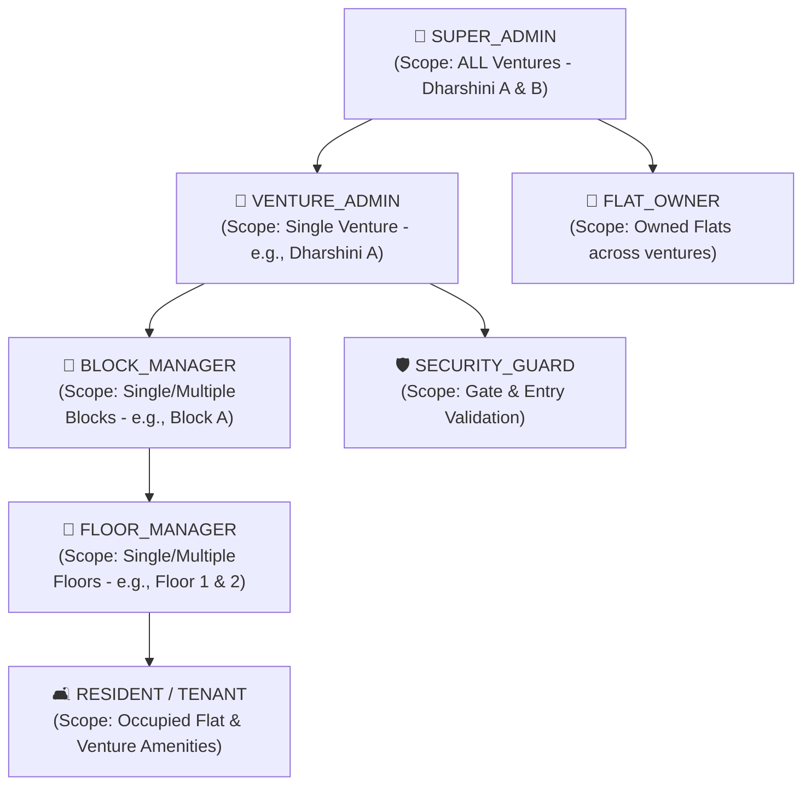
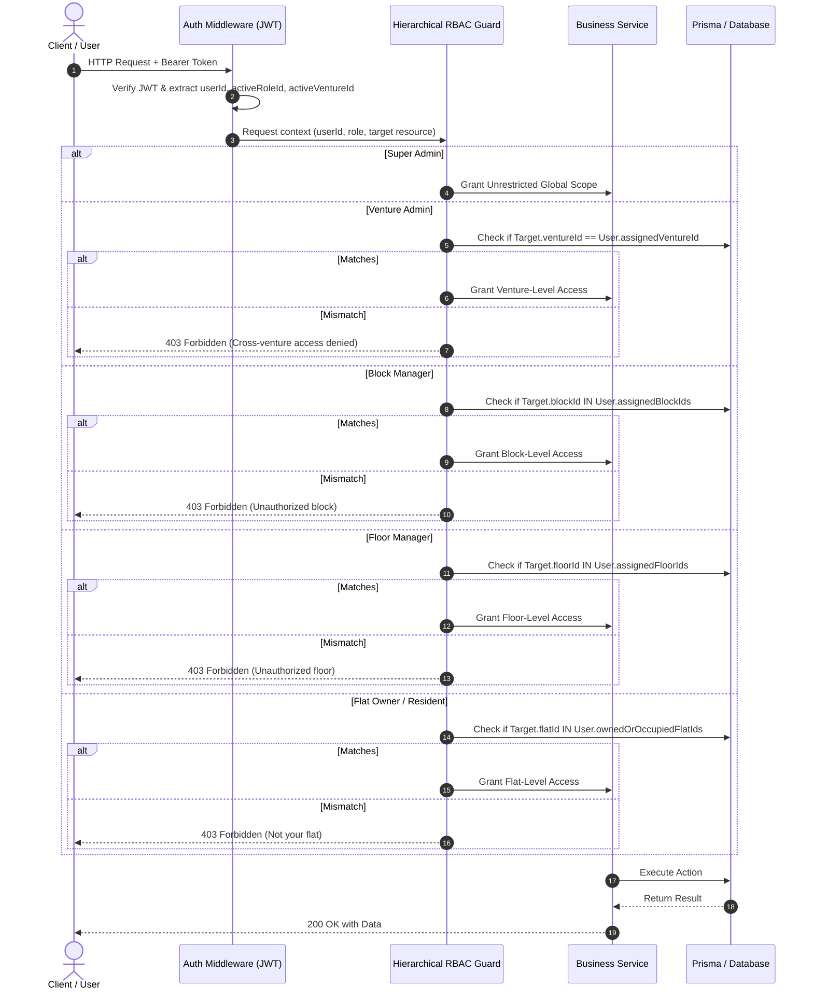

# Urban Nest: Hierarchical Role-Based Access Control (RBAC) & Permission Engine

---

## 1. Overview & Problem Definition

In a multi-venture property system, permissions cannot be flat or purely binary. A user might be:
- An **Admin** across multiple entire ventures (e.g. managing both **Dharshini A** and **Dharshini B**).
- A **Block Manager** for Block A in Dharshini A only.
- A **Floor Manager** for Floor 3 in Block A.
- A **Flat Owner** who owns flats in Dharshini A (Flat 101) and Dharshini B (Flat 204).

The RBAC system employs **Hierarchical Scoped Authorization**, evaluating permissions along the spatial hierarchy:
`Global Organization` ➔ `Venture` ➔ `Block` ➔ `Floor` ➔ `Flat`.

---

## 2. Role Hierarchy & Scopes

---

## 3. Comprehensive Permission Matrix

| Resource & Action | SUPER_ADMIN (Multi-Venture) | VENTURE_ADMIN (Single Venture) | BLOCK_MANAGER (Assigned Block) | FLOOR_MANAGER (Assigned Floor) | OWNER (Owned Flats) | RESIDENT (Occupied Flat) | GUARD |
|---|---|---|---|---|---|---|---|
| **Ventures (CRUD)** | Full (All) | Read Own | Read Own | Read Own | Read Own | Read Own | No |
| **Blocks (Create / Edit)** | Full (All) | Full (Own Venture) | Read Assigned | Read Assigned | Read Assigned | Read Assigned | No |
| **Floors (Create / Edit)** | Full (All) | Full (Own Venture) | Full (Assigned Block) | Read Assigned | Read Assigned | Read Assigned | No |
| **Flats (Create / Edit / Status)** | Full (All) | Full (Own Venture) | Full (Assigned Block) | Update Status / Audit | Read Own | Read Own | Read Assigned |
| **Owner Profile & Deed Linking** | Full (All) | Full (Own Venture) | Read Assigned | Read Assigned | Manage Self / Profile | No | No |
| **Amenity Catalog (Master List)** | Full (All) | Read Only | Read Only | Read Only | Read Only | Read Only | Read Only |
| **Venture Amenities (Enable/Disable/Pricing)** | Full (All) | Full (Own Venture) | Read | Read | Read | Read | Read |
| **Amenity Booking (Create / Cancel)** | Full (Override) | Full (Approve/Reject) | View Block Bookings | No | Book for Own Flat | Book for Own Flat | Verify QR Pass |
| **Maintenance Billing & Invoicing** | Full (All) | Full (Own Venture) | View Block Dues | View Floor Dues | View / Pay Own Bills | View Invoices | No |
| **Helpdesk Tickets (Create)** | Any | Any | Any | Any | For Own Flat | For Own Flat | Create Gate Incident |
| **Helpdesk Tickets (Resolve / Escalate)** | Full (All) | Full (Own Venture) | Resolve Block Issues | Resolve Floor Issues | View Own | View Own | View Gate Tickets |
| **Role Assignment (Grant / Revoke)** | All Roles | Block & Floor Mgrs | No | No | No | No | No |

---

## 4. Scope Resolution Algorithm & Middleware

When an authenticated user invokes an endpoint (e.g., `GET /api/v1/flats/:id` or `POST /api/v1/amenities/:id/book`), the authorization middleware resolves access:

---

## 5. Multi-Role User Context Switching

Users can hold multiple roles across different ventures. For example:
- User **Dr. Sunita** is a `SUPER_ADMIN` over Dharshini A & Dharshini B, but also owns a flat in Dharshini A as a `FLAT_OWNER`.
- The frontend provides a **Role & Venture Switcher** in the header.
- Switching sends the desired `activeRole` and `activeVentureId` in the JWT header or session context, effortlessly toggling dashboard views between high-level executive analytics and personal flat owner controls.
