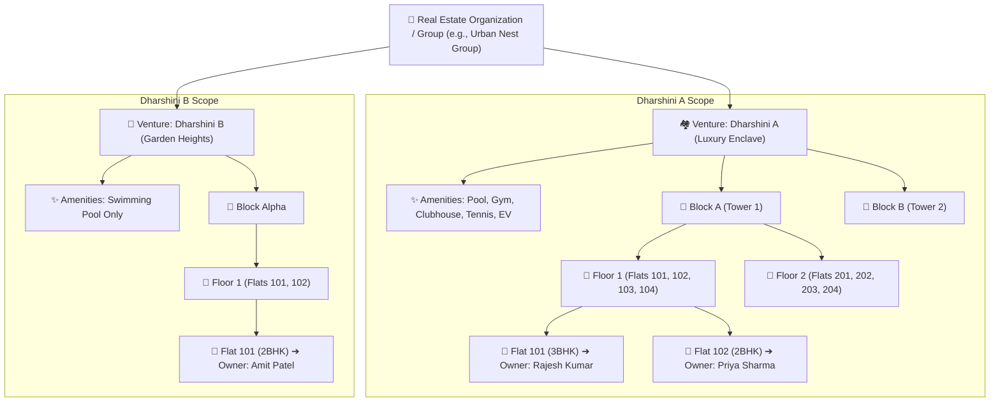

# Urban Nest: Multi-Venture Property & Apartment Management Platform
## System Architecture Specification

---

## 1. Executive Summary & Problem Analysis

Modern PropTech management systems face significant challenges when scaling from single-building societies to multi-venture real estate portfolios. Key architectural complexities include:

1. **Multi-Venture Hierarchy**: Organizations (such as "Dharshini Developers" or "Urban Nest Group") manage multiple distinct properties or apartment communities (e.g., **Dharshini A** and **Dharshini B**). Each venture has its own address, rules, and configuration.
2. **Heterogeneous Amenities & Facilities Engine**: Different ventures possess differing facilities. For instance:
   - **Dharshini A**: Premium venture with 10+ amenities (Infinity Swimming Pool, Gymnasium, Badminton Courts, Clubhouse, Banquet Hall, EV Charging Stations, Rooftop Lounge, Steam & Sauna).
   - **Dharshini B**: Compact venture with a single amenity (Swimming Pool).
   The system must allow polymorphic amenity attachment, custom operating hours, pricing rules, capacity constraints, and booking workflows per venture.
3. **Deep Structural Segregation**:
   - `Venture` ➔ `Block / Tower` ➔ `Floor` ➔ `Flat / Unit` ➔ `Unique Owner & Residents`.
   - Flats must be uniquely mapped to registered owners with ownership deed records, occupancy statuses (Owner-Occupied, Tenant, Vacant), and parking allocations.
4. **Hierarchical Role-Based Access Control (RBAC)**:
   - **Super Admin**: Oversees multiple ventures simultaneously (e.g., handles both Dharshini A and Dharshini B).
   - **Venture Admin**: Oversees a specific venture/community.
   - **Block Manager**: Scoped strictly to assigned Block(s) within a venture.
   - **Floor Manager**: Scoped to assigned Floor(s) in a block.
   - **Owner / Resident**: Scoped strictly to their owned/rented flat(s) and their venture's amenities.
   - **Facility / Security Guard**: Entry verification, visitor logging, and amenity booking pass validation.

---

## 2. High-Level System Architecture

```mermaid
graph TB
    subgraph Client Layer ["Client Tier (Web & Mobile Responsive)"]
        SA_UI["Super Admin Dashboard<br/>(Cross-Venture Analytics)"]
        VA_UI["Venture Admin Portal<br/>(Dharshini A / B Controls)"]
        BM_UI["Block & Floor Manager UI<br/>(Ops & Maintenance Desk)"]
        OW_UI["Resident & Owner App<br/>(Amenities, Bills, Passes)"]
    end

    subgraph Gateway ["API Gateway & Security Layer"]
        GW["API Gateway / Reverse Proxy"]
        AUTH_MW["JWT Auth & Session Manager"]
        RBAC_MW["Hierarchical Scope Enforcer<br/>(Venture / Block / Floor Resolution)"]
        RATE_LIM["Rate Limiter & Input Sanitizer (Zod)"]
    end

    subgraph Service Layer ["Application Core (Modular Monolith)"]
        VMS["Venture & Property Service"]
        BMS["Block & Floor Hierarchy Service"]
        FOS["Flat & Owner Portfolio Service"]
        AMS["Amenities & Booking Engine"]
        MBS["Maintenance & Invoicing Service"]
        TKS["Helpdesk & Floor Issue Escalation Service"]
        NTS["Notification & Realtime Broadcast"]
    end

    subgraph Data Layer ["Data & Persistence Tier"]
        DB[(Relational DB / PostgreSQL)]
        PRISMA["Prisma ORM Layer"]
        CACHE["In-Memory Cache (Redis/LRU)"]
    end

    Client Layer --> GW
    GW --> AUTH_MW
    AUTH_MW --> RBAC_MW
    RBAC_MW --> RATE_LIM
    RATE_LIM --> Service Layer
    Service Layer --> PRISMA
    PRISMA --> DB
    Service Layer --> CACHE
```

---

## 3. Physical & Logical Domain Hierarchy

The hierarchy is strictly structured to support drill-down querying, localized permissions, and isolated maintenance billing:



---

## 4. Core Micro-Modules & Subsystems

### 4.1 Venture & Property Module
- Handles multi-venture creation, address geo-tagging, property rules, and global parameters.
- Provides a centralized dashboard for executive management across multiple properties.

### 4.2 Structural Segregation Module (Blocks, Floors, Flats)
- Dynamic hierarchy generator allowing varying numbers of blocks per venture, varying floors per block, and custom unit numbering conventions.
- Flat categorization: Unit types (1BHK, 2BHK, 3BHK, Penthouse, Duplex), built-up area (Sq Ft), carpet area, parking slot allocations, utility meter associations.

### 4.3 Owner & Resident Management Engine
- Segregates unique owner identities from flat physical assets.
- Allows an owner to hold multiple properties across different blocks or even across ventures (e.g. Owner *Rajesh* owns Flat 101 in Dharshini A and Flat 101 in Dharshini B).
- Tracks primary owners, co-owners, tenants/residents, and lease lifecycles.

### 4.4 Dynamic Amenities & Slot Booking Engine
- Master **Amenity Catalog** (centralized definitions: Pool, Gym, Tennis, Squash, EV Charging, Banquet Hall, Spa).
- **Venture-Amenity Association**: Each venture chooses which catalog items to activate, setting local rules:
  - Max capacity per slot
  - Slot duration (e.g., 60 mins for Gym, 45 mins for Tennis, 4-hour slots for Banquet Hall)
  - Operating hours (e.g. 06:00 - 22:00)
  - Access fees (Free for residents vs paid for guest access)
  - Advance booking limits (e.g., max 3 days in advance)
- Generates secure digital QR passes for access control.

### 4.5 Hierarchical Role & Permission Dispatcher
- Dynamic context-aware authorization. When a user requests data or actions:
  - Super Admin: Bypasses scope filters.
  - Venture Admin: Scoped with `where: { ventureId }`.
  - Block Manager: Scoped with `where: { blockId }`.
  - Floor Manager: Scoped with `where: { floorId }`.
  - Owner: Scoped with `where: { flat: { ownerId } }`.

---

## 5. Technology Stack Architecture

| Layer | Component | Technology / Library | Rationale |
|---|---|---|---|
| **Backend Runtime** | Runtime Environment | Node.js (v20+ LTS) with TypeScript | Type safety, asynchronous high-concurrency event loop |
| **Web Framework** | REST API Server | Express.js / Fastify | Robust routing, lightweight, extensive ecosystem |
| **ORM / Query Engine** | Database Layer | Prisma ORM | Strong schema typing, automatic migrations, relation queries |
| **Database** | Relational Database | PostgreSQL / SQLite (Development) | ACID compliance, relational integrity, JSONB support |
| **Authentication** | Security & Auth | JWT (Access & Refresh) + Argon2/Bcrypt | Stateless secure token auth with granular claims |
| **Validation** | Data Integrity | Zod / Joi Schema Validation | Compile-time and runtime type validation on all inputs |
| **Frontend UI** | Dashboard Client | React 18 + Vite + TypeScript | Blazing fast HMR, reactive state management |
| **Styling System** | UI / UX Design | Custom Vanilla CSS (Design Tokens, Glassmorphism) | Ultra-premium bespoke aesthetics without heavy framework lock-in |
| **Icons & Fonts** | Typography & Icons | Lucide-React + Google Fonts (Outfit & Inter) | Modern, clean typography and crisp vector iconography |
